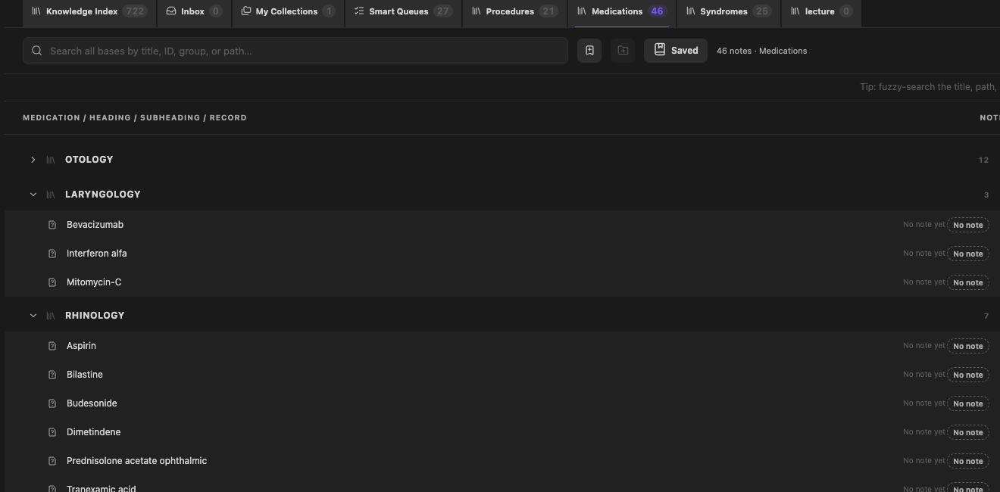
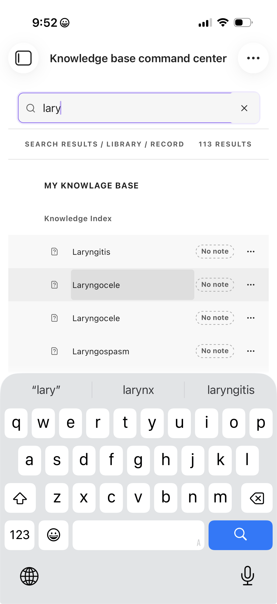

# Knowledge Base Command Center

Turn an Obsidian vault into a navigable knowledge system. Visual organization stays in plugin data; an optional explicit Quick append action can add categorized follow-up items to a selected Markdown note.

_Abstract concept artwork, not a product screenshot. Real, sanitized captures of version 0.10.0 appear below; see [asset provenance](docs/assets/README.md)._

## Install from Obsidian Community Plugins

Knowledge Base Command Center is available in the [Obsidian Community Plugins directory](https://community.obsidian.md/plugins/ent-vault-command-center).

1. Open **Settings → Community plugins → Browse**.
2. Search for **Knowledge Base Command Center**.
3. Choose **Install**, then **Enable**.
4. Open the Command Center from the desktop ribbon or Command palette and complete the setup wizard. On mobile, use Obsidian's **Open** menu.

Requires Obsidian 1.13.0 or newer. The stable internal ID `ent-vault-command-center` is intentionally retained so upgrades preserve existing plugin data.

**Quick links:** [Getting started](docs/GETTING_STARTED.md) · [User guide](docs/USER_GUIDE.md) · [Portability and recovery](docs/PORTABILITY_AND_RECOVERY.md) · [Troubleshooting](docs/TROUBLESHOOTING.md) · [Support](SUPPORT.md)

## See it in Obsidian

_Real, sanitized desktop capture from version 0.10.0. It shows the optional ENT preset's Medications Library; “No note” rows are portable placeholders, not missing application data._

  

_Real iPhone portrait capture from version 0.10.0 showing one search state with compact result rows above the software keyboard. It is not evidence that the complete physical-device matrix passed; see the [0.10.0 iPhone evidence note](docs/release-evidence/0.10.0-iphone.md)._

## What it helps you do

- **See the structure you already have.** Build a searchable visual index over a folder, then add eligible notes from elsewhere in the vault.
- **Separate contexts cleanly.** Keep research, study, projects, or another subject area in independent knowledge bases within one installation.
- **Organize without file churn.** Nest, reorder, group, classify, pin, and collect records in plugin data without moving or rewriting ordinary Markdown notes.
- **Create consistently.** Start empty notes or copy a chosen template into a safely previewed destination.
- **Capture from anywhere.** Open Quick entry from the desktop ribbon, the mobile **Open** menu, the Command Center header, a user-assigned hotkey, the mobile toolbar, or an action-only Obsidian URL.
- **Transfer organization deliberately.** Export path-free index and Library blueprints, selected personal organization, or a private same-vault recovery package.
- **Work on desktop and mobile.** Use drag-and-drop on desktop and labelled action menus on touch devices.

Typical uses include a research library with Methods and Papers, a project index with reusable review queues, a study system with cross-topic collections, or the optional protected ENT clinical preset.

## The three organizing levels

| Concept | What it is | Membership |
| --- | --- | --- |
| **Knowledge base** | An independent Command Center index profile with its own folder scope, labels, Libraries, collections, queues, templates, history, and settings. It is not an Obsidian <code>.base</code> file or saved Workspace layout. | The same Markdown note can be organized independently in more than one knowledge base. |
| **Library** | A top-level category inside one knowledge base, with its own icon, headings, subheadings, order, and unplaced section. The Knowledge Index is the base's default primary section. | A subject has one primary Index/Library section per knowledge base. |
| **Collection** | A reusable personal list that can span the Index and Libraries, with optional headings and subheadings. | A subject can belong to several Collections without being duplicated, moved, or reclassified. |

## Quick start

1. **Create a knowledge base.** For most users, choose **Generic knowledge base** and select the folder containing the notes to index. The ENT clinical preset is optional.
2. **Review the Index.** Notes below the configured folder appear automatically. Use **Add → Add existing note to Index** for an eligible note elsewhere in the vault.
3. **Shape the view.** Choose **Arrange** to group, nest, and reorder records visually. These changes remain in plugin data.
4. **Add Libraries and Collections.** Use Libraries for primary categories such as Papers or Projects; use Collections for reusable lists that cross categories.
5. **Create safely.** Use **Quick entry** to choose a knowledge base, Index/Library destination, visual group, and either an empty note or local template.
6. **Back up organization.** Export a current same-vault recovery for each knowledge base and keep it private.

The [Getting started guide](docs/GETTING_STARTED.md) covers installation, first-device Sync precautions, updates, and uninstall behavior.

## Feature overview

### Visual index and Index Manager

The index starts from a configured folder and optional ID, group, and parent properties. Visual arrangement changes only plugin-owned organization. **Manage Index…** provides Indexed, Available, Hidden, Groups, and Diagnostics views for bulk membership and safe integrity repair.

### Custom Libraries and Collections

Create, name, icon, reorder, archive, and restore custom Libraries. Inside a Library, add headings and nested subheadings, place existing records, and use an explicit Unplaced section when structure changes. Collections support cross-category, multi-membership lists.

The ENT preset supplies protected Procedures, Medications, and Syndromes Libraries. Custom Libraries remain visual containers and do not rewrite clinical files or frontmatter.

### Multiple knowledge bases and search

A non-empty search covers every available, non-archived knowledge base. Results are grouped by knowledge base and Library, with the active base first. Selecting a result from another base switches the plugin-wide active base before opening or selecting it.

Search is Unicode-aware and normalizes common diacritic, apostrophe, Arabic, and Persian keyboard variants. Advanced filters include <code>domain:</code>, <code>priority:</code>, <code>kind:</code>, <code>type:</code>, <code>status:</code>, <code>review:</code>, <code>source:</code>, <code>safety:</code>, <code>dose:</code>, and <code>image:</code>. Broad searches report the full count and state **Showing the first 300 of _N_ results.** Browse views expose **Show more** instead of building an unbounded mobile DOM.

### Obsidian Bases integration

Obsidian `.base` files can select the plugin's **Knowledge hierarchy** view without becoming a Knowledge Base Command Center knowledge base. The stable view type remains <code>ent-hierarchy</code>. Its native Bases options choose title, ID, fallback group, status, and priority properties, a 25–300-row page size, and whether group counts appear.

The view reads note, file, and formula values through Obsidian's Bases API. A `.base` file's filters, limit, sort, and **Group by** order remain authoritative. When no native Group by is configured, the fallback group property defaults to <code>note.domain</code>, then to the note's immediate folder. Large results are prepared in bounded slices, and **Previous** and **Next** replace one configured page at a time so offscreen rows do not accumulate. Narrow panes stack row metadata and retain 44-pixel row and pager targets. Opening a row opens the Markdown file and does not change frontmatter or plugin organization.

### Quick entry, hotkeys, and mobile toolbar

Quick entry is available from the lightning-bolt desktop ribbon action and the Command Center header. On mobile, Obsidian exposes ribbon actions in its **Open** menu. Its focused commands can create a No note subject, heading, subheading, or note, add the current or an existing note, and open Quick append for the current or a chosen note. Library capture asks for the exact heading or subheading before it creates or classifies a note. The hub can switch the active knowledge base before opening an entry form.

The plugin assigns no default key combinations. Choose your own under **Settings → Hotkeys**. On iPhone or iPad, open **Settings → Mobile → Manage toolbar options**, scroll to the bottom, choose **Add global command**, then search for and select **Quick entry…** or another focused command.

Apple Shortcuts can open the hub with <code>obsidian://kbcc-quick-entry</code>, Quick append for the active note with <code>obsidian://kbcc-quick-append-current</code>, or the note picker with <code>obsidian://kbcc-quick-append-existing</code>. These routes are fixed and action-only. A URL containing <code>?title=</code>, <code>?path=</code>, or any other parameter fails closed; a URL can never prefill or submit note data.

### Quick append follow-up notes

Quick append adds one item to a strict plugin-owned block at the end of a chosen Markdown note. The default categories are Questions, Lectures to watch, Sources, Thoughts, To read, and Other. Reusing a category appends below its existing heading instead of creating another heading. Categories are configurable per knowledge base: rename, reorder, add, archive, restore, and choose bullet or checkbox style with an optional date.

The operation uses Obsidian's atomic note-processing API, refuses <code>ai_lock: true</code>, preserves text outside the managed block byte-for-byte, and offers a short exact undo that refuses to run after the note changes. Note bodies and appended text are never copied into plugin data. Quick append writes Markdown text only; normal paste, drag, and attachment placement continue to follow Obsidian's Files and Links settings.

### Note creation and placeholders

Create an empty note or copy a local Markdown template using <code>{{title}}</code>, <code>{{date}}</code>, and <code>{{time}}</code>. The destination is previewed, missing folders are created safely, and an existing file is never overwritten.

Portable imports never create notes automatically. A path-free imported subject can remain a **No note** placeholder, link to an existing note, or—where the profile permits—create an empty or template-based note.

### Undo, snapshots, export, and recovery

Personal organization supports Undo/Redo and named snapshots. Portable exports can carry workspace settings, a path-free Index blueprint, selected Libraries, Collections, study state, and saved views. Same-vault recovery is a separate private restoration format containing exact vault-relative paths.

Portable packages created by version 0.10.0 use format version 4. Current v9 files include dynamic Library definitions and layouts and are locked to their source vault, base, and preset by default. Read [Portability and recovery](docs/PORTABILITY_AND_RECOVERY.md) before importing, replacing, or restoring data.

## Generic and ENT profiles

| | Generic knowledge base | ENT clinical preset |
| --- | --- | --- |
| Best for | Research, study, projects, courses, and other folder-based knowledge bases | The original protected ENT study workflow |
| Index scope | Configurable | Canonical clinical scope is protected |
| Libraries | User-defined | User-defined plus protected Procedures, Medications, and Syndromes |
| File-changing workflows | Explicit note creation only | Note creation plus two separately disclosed, confirmation-gated canonical workflows |
| Clinical approval | Not applicable | The plugin never grants clinical review approval and respects <code>ai_lock: true</code> |

The ENT preset is an organization workflow, not medical advice, a medical record, or autonomous clinical decision support.

## Compatibility

| Surface | Status |
| --- | --- |
| Obsidian | 1.13.0 or newer |
| Desktop | Uses Obsidian-compatible APIs; no Electron- or Node-only runtime dependency |
| iPhone and iPad | Supported through touch menus and mobile layouts; consult the current [physical-device evidence](docs/release-evidence/0.10.0-iphone.md) rather than assuming every release checklist item passed |
| Android | The manifest is mobile-compatible, but this repository does not currently document a complete physical-Android test pass |
| Network | No plugin network requests, analytics, telemetry, accounts, advertising, or payments |

## Privacy and permissions

- The plugin enumerates whole-vault Markdown file paths and cached Markdown metadata to build and reconcile indexes, offer note/template choices, and diagnose stale references.
- It enumerates all loaded vault entries before retaining folder paths for settings pickers, and enumerates all vault file paths before retaining JSON packages for the in-vault picker. Path enumeration alone does not read note bodies.
- Content reads are targeted to an explicitly chosen template or JSON import, to the note explicitly selected for Quick append inside Obsidian's atomic process operation, and to the disclosed ENT proposal-promotion and canonical-placement workflows.
- Copy buttons write only the plugin-generated command, wikilink, or path you selected; the plugin never reads clipboard contents.
- Settings and organization are stored in Obsidian's plugin <code>data.json</code>. Sync reconciliation, schema migration, and vault renames can update that file automatically.
- The Quick entry Obsidian protocol accepts only its intrinsic action. Any query parameter is rejected before a form opens; titles, paths, and content cannot be supplied by URL.
- No export contains Markdown note bodies or attachments. Workspace settings can contain configured vault-relative folders, and saved searches preserve literal query text.
- Same-vault recovery and automatic conflict rescues contain exact vault-relative paths. Keep them private.
- The plugin itself does not read or write outside the vault. On desktop, export and import use operating-system download/file-picker surfaces, so files go where the user chooses.

See [Portability and recovery](docs/PORTABILITY_AND_RECOVERY.md) for the exact export boundary and [Security](SECURITY.md) for the trust model.

## Data safety

- Ordinary indexing, visual arrangement, membership, Library classification, and Collection actions never move, rename, delete, or rewrite source notes.
- Removing or hiding membership does not delete the Markdown file.
- Merge and Replace imports change selected plugin-owned organization only.
- Newer or unrecognized plugin data opens read-only rather than being overwritten by an older build.
- Quick append is a deliberate generic exception to the ordinary no-file-change rule. It atomically writes one item inside a strictly marked follow-up block in the selected note, refuses <code>ai_lock: true</code>, and keeps note bodies out of plugin data.
- Two additional ENT-only workflows can change selected files: proposal promotion moves the selected proposal and updates its frontmatter and top-level heading; advanced canonical placement may move the selected canonical note and updates the same structural fields. Both refuse <code>ai_lock: true</code>, require explicit action, preview the destination, and attempt rollback if an operation fails.

## Backup and recovery

Same-vault recovery protects plugin-owned organization for one knowledge base; it is not a backup of Markdown notes or attachments. Back up the complete vault, including <code>.obsidian</code>, and export one current private recovery per available base. Archived bases must be restored temporarily before export.

Recovery is a standalone replacement, never a merge with portable sections. Current recovery verifies source vault, base, and preset before mutation. Older identity-less formats require additional overrides and conservative path checks. Follow the complete [backup and restore procedure](docs/PORTABILITY_AND_RECOVERY.md#backup-and-restore).

## Known limitations

- At most 50 available and archived knowledge bases and 50 active and archived Libraries per knowledge base are retained.
- The active knowledge base is plugin-wide; every open Command Center view switches together.
- Export, import, snapshots, and Undo history are base-local.
- Export and import operate on the active base; switch bases to handle each one separately.
- Portable exports include selected active Libraries; confirmed private recovery preserves archived Library state.
- Concurrent or offline edits to the same established base use whole-base last-write-wins reconciliation, not field-level merging. Avoid editing the same base on two devices at once, let Sync settle before switching devices, and keep current recovery exports.
- Search retains at most the strongest 300 visible matches while reporting the full count. Browse rows and structural sections page in groups of 300.
- Desktop offers drag-and-drop; touch devices use labelled row action menus.
- Same-vault recovery is intentionally not portable.
- Real-iPhone keyboard, safe-area, Dynamic Type, landscape, import/export, and destructive recovery behavior needs explicit physical-device evidence. Automated DOM checks are not a substitute.
- Version 0.11.0 adds automated compact-layout coverage for Quick entry, but its complete physical-iPhone toolbar and Apple Shortcuts matrix still requires manual release evidence.

## Other installation methods

### BRAT

Install [BRAT](https://github.com/TfTHacker/obsidian42-brat), run **BRAT: Add a beta plugin for testing**, and enter this repository URL. You can also use the [direct BRAT install link](obsidian://brat?plugin=https://github.com/drbinsaad/knowledge-base-command-center).

### Manual installation

Download matching <code>main.js</code>, <code>manifest.json</code>, and <code>styles.css</code> files from one [GitHub release](https://github.com/drbinsaad/knowledge-base-command-center/releases). Place all three directly inside:

~~~text
<your-vault>/.obsidian/plugins/ent-vault-command-center/
~~~

Reload Obsidian and enable the plugin. Never mix files from different releases.

### Updating on iPhone and iPad

Let vault and configuration Sync finish before updating and avoid editing the same knowledge base on another device. Update through Community Plugins or BRAT on the device, or replace all three manual assets together on desktop and wait for the hidden <code>.obsidian</code> folder to sync. Then confirm the plugin is enabled before opening the Command Center.

### Uninstall

Export current organization first. Disable and remove the plugin through Community Plugins, or remove its manual plugin folder. Removing that folder also removes its <code>data.json</code>, including knowledge bases, settings, Libraries, Collections, pins, hierarchy, snapshots, and Undo history. Markdown notes are not removed.

## Troubleshooting

- **Visual movement on iPhone:** choose **Arrange**, open a row's **…** menu, then use Move under, Indent, Outdent, Move up/down, or Make top-level.
- **Missing note or unexpected Library:** check the active knowledge base, Index Manager membership, hidden records, and the record's primary Index/Library section.
- **Read-only settings or salvage mode:** preserve <code>data.json</code> and do not force a downgrade. See [Troubleshooting](docs/TROUBLESHOOTING.md).

## Documentation

- [Getting started](docs/GETTING_STARTED.md)
- [User guide](docs/USER_GUIDE.md)
- [Portability and recovery](docs/PORTABILITY_AND_RECOVERY.md)
- [Troubleshooting](docs/TROUBLESHOOTING.md)
- [0.10.0 iPhone evidence](docs/release-evidence/0.10.0-iphone.md)
- [Manual real-iPhone release checklist](docs/manual-iphone-release-checklist.md)
- [Changelog](CHANGELOG.md)

## Development

Requires Node.js 22 and npm.

~~~bash
npm ci
npm run review
~~~

The review task runs strict typechecking, zero-warning lint, unit and rendered-DOM tests, a production build, Community-oriented static checks, and release verification. See [Contributing](CONTRIBUTING.md) before opening a pull request.

The production assets are <code>main.js</code>, <code>manifest.json</code>, and <code>styles.css</code>. A local ZIP and SHA-256 checksum can be built with <code>npm run release:bundle</code>.

## Support, security, and license

Use [Support](SUPPORT.md) for questions, sanitized bug reports, and feature requests. Do not put vulnerabilities or private vault information in a public issue; read the current [Security policy](SECURITY.md) for the available disclosure route.

Knowledge Base Command Center is released under the [MIT License](LICENSE).
