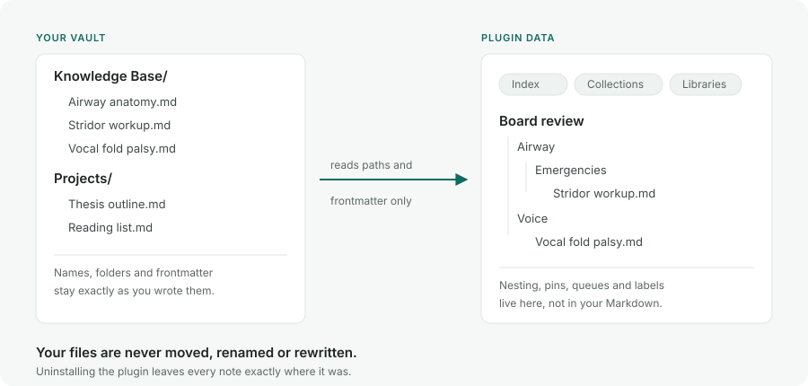

# Knowledge Base Command Center

**Give any Obsidian vault a real structure — an index, libraries, collections, and queues — without moving, renaming, or rewriting a single note.**

_Abstract AI-generated concept artwork, not a product screenshot. Real, sanitized captures appear below; see [asset provenance](docs/assets/README.md)._

Build each Index from notes you explicitly add and, when you want dynamic folder membership, folders you explicitly link. A default new-note folder controls storage only: putting a note there never enrolls it in the Index by itself. From there you arrange, group, nest, pin, and classify records into Libraries and Collections — and all of that organization lives in the plugin's own data, not in your Markdown. Your files stay exactly where you put them, with the frontmatter you wrote. One installation can hold several independent knowledge bases, so research, study, and project work never bleed into each other. Everything is local: the plugin makes no network request, has no account, and sends no telemetry.

**Quick links:** [Getting started](docs/GETTING_STARTED.md) · [User guide](docs/USER_GUIDE.md) · [Portability and recovery](docs/PORTABILITY_AND_RECOVERY.md) · [Troubleshooting](docs/TROUBLESHOOTING.md) · [Apple Shortcuts](docs/APPLE_SHORTCUT.md) · [Templates](templates/README.md) · [Support](SUPPORT.md)

## How it works

_Diagram, not a screenshot._ The plugin reads paths and cached frontmatter for direct note memberships and explicit linked-folder rules, then builds structure in **its own data**. A note's storage folder is otherwise irrelevant to Index membership. Collections can nest up to five levels, records can sit in several places at once, and Generic organization never rewrites your Markdown. Uninstall and every file is exactly where you left it.

### In the app

_Real, sanitized desktop capture from 0.10.0. It shows the optional ENT preset's Medications Library; “No note” rows are portable placeholders, not missing application data._

  

_Real iPhone portrait capture showing one search state with compact result rows above the software keyboard. It is not evidence that the complete physical-device matrix passed; see the [0.10.0 iPhone evidence note](docs/release-evidence/0.10.0-iphone.md)._

## Install

### From the Obsidian community store

Knowledge Base Command Center is published in the [Obsidian Community Plugins directory](https://community.obsidian.md/plugins/ent-vault-command-center). This is the recommended route — it handles updates for you.

1. Open **Settings → Community plugins → Browse**.
2. Search for **Knowledge Base Command Center**.
3. Choose **Install**, then **Enable**.
4. Open the Command Center from the desktop ribbon or Command palette and complete the setup wizard. On mobile, use Obsidian's **Open** menu.

Requires Obsidian 1.13.0 or newer, on desktop or mobile. The stable internal ID `ent-vault-command-center` is intentionally retained so upgrades preserve existing plugin data.

### BRAT

Install [BRAT](https://github.com/TfTHacker/obsidian42-brat), run **BRAT: Add a beta plugin for testing**, and enter this repository URL. There is also a [direct BRAT install link](obsidian://brat?plugin=https://github.com/drbinsaad/knowledge-base-command-center).

### Manual

Download matching `main.js`, `manifest.json`, and `styles.css` files from one [GitHub release](https://github.com/drbinsaad/knowledge-base-command-center/releases) and place all three directly inside:

~~~text
<your-vault>/.obsidian/plugins/ent-vault-command-center/
~~~

Reload Obsidian and enable the plugin. Never mix files from different releases.

### Updating on iPhone and iPad

Let vault and configuration Sync finish before updating, and avoid editing the same knowledge base on another device while the update runs. Update through Community Plugins or BRAT on the device, or replace all three manual assets together on desktop and wait for the hidden `.obsidian` folder to sync. Then confirm the plugin is enabled before opening the Command Center.

After an existing installation first opens version 0.12.0 or any later release with curated notes (every release since then has them), a one-time **What’s new** window summarizes that release. **Read complete release notes** is an ordinary external link to that exact GitHub release and opens only when you choose it — the plugin does not contact GitHub, check the network, or send telemetry. The window is not shown for a truly fresh install and is remembered only in this device's App-local record. Run **Open what’s new** from the Command palette to reopen it deliberately.

First-device Sync precautions and the exact per-route update steps are in [Getting started](docs/GETTING_STARTED.md#updating-on-iphone-and-ipad).

### Uninstall

Export your current organization first. Then run **Knowledge Base Command Center: Clear device-local data…** and confirm, before disabling and removing the plugin through Community Plugins (or deleting its manual plugin folder).

The plugin folder contains `data.json` with synced knowledge bases, settings, Libraries, Collections, pins, hierarchy, and named snapshots. Device-only routes, collapsed sections, Undo/Redo history, local Sync/Recovery facts, and the highest plugin version observed for one-time update announcements are stored through Obsidian's App-local storage outside that folder, so deleting only the folder does not reliably remove them. A third, bounded rename-recovery journal may temporarily contain the vault identity and old/new vault-relative paths until an interrupted organization repair is durably completed. A fourth, bounded return-navigation history can contain the vault identity, up to 24 opened-note paths, their originating base and tab, a selected-record path, literal search text entered in KBCC, compact-detail state, and scroll positions so a note can return to the same KBCC page after restart. KBCC does not read or copy note bodies into this history, but user-entered search text can itself be sensitive; the history is not synced. The clear command removes all four plugin-owned App-local values without changing `data.json`, Markdown notes, attachments, or recovery export files, and local tracking stays suppressed until Obsidian restarts — disable or uninstall in that same session. If you already removed the plugin without clearing them, reinstall and enable the same or a newer release, run the clear command, then remove it again.

## Quick start

1. **Create a knowledge base.** Choose **Generic knowledge base** and select the default folder for notes you create later. This is a storage default, not an Index rule. (The ENT clinical preset is optional and is described below.)
2. **Choose membership deliberately.** Use **Add → Add existing note to Index** for durable one-note membership, or **Organize** to review several existing notes and one or more knowledge-base destinations together. When you deliberately link a folder, its eligible current and future Markdown descendants join through that named rule; selecting a folder in the Organizer is instead a one-time snapshot and never links it.
3. **Shape the view.** Choose **Arrange**, then group, nest, and reorder records. Drag on desktop; use each row's **…** menu on touch devices. Nothing on disk changes.
4. **Add Libraries and Collections.** Libraries are primary categories such as Papers or Projects. Collections are reusable lists that cut across them — a note can belong to many Collections at once.
5. **Export a recovery package.** Create a same-vault recovery export for each knowledge base and keep it private. This is what restores your organization if plugin data is ever lost.

Then read the [Getting started guide](docs/GETTING_STARTED.md).

## The three organizing levels

| Concept | What it is | Membership |
| --- | --- | --- |
| **Knowledge base** | An independent Command Center index profile with its own direct members, linked-folder rules, labels, Libraries, collections, queues, templates, history, and settings. It is not an Obsidian `.base` file or a saved Workspace layout. | The same Markdown note can be organized independently in more than one knowledge base. |
| **Library** | A top-level category inside one knowledge base, with its own icon, headings, subheadings, order, and unplaced section. The Knowledge Index is the base's default primary section. | A subject has one primary Index/Library section per knowledge base. |
| **Collection** | A reusable personal list that can span the Index and Libraries, with optional headings and nested subheadings. | A subject can belong to several Collections without being duplicated, moved, or reclassified. |

## Feature tour

### Visual index and Index Manager

The Index starts empty in a new Generic base. **Add existing note to Index** records direct membership that does not depend on where the note is stored. An explicit linked-folder rule can instead supply eligible current and future descendants dynamically. The default new-note folder, Inbox folder, template folder, and per-Library creation folders are storage or workflow settings; none becomes an Index source merely because it is configured.

Generic bases loaded from pre-v15 plugin data retain their former `primaryFolder` behavior temporarily as one reviewable legacy linked-folder source. This compatibility migration prevents existing entries from disappearing silently, but the Command Center and Settings keep a warning visible until you make an explicit choice. **Review…** lists the real notes currently available on this device and supplied only by that folder: keep selected notes as durable direct members and unlink the folder in one Undo-protected action, intentionally **Keep linked** for current and future descendants, or choose **Not now**. Apply stays blocked if a non-root source folder is unavailable, and every unlink requires you to confirm that Obsidian Sync has finished and the folder contents are complete on this device; a locally empty list alone is never treated as proof that every synced copy is empty. Unlinking removes only membership supplied by the rule; no Markdown file is moved, deleted, or rewritten.

Index rows label why they belong: **Direct**, **Linked folder**, **Imported placeholder**, or **Protected source**. Open a row's **Why this appears** action for every applicable authority plus its separately labelled storage location. **Manage Index… → Why included** gives the same distinction across the whole knowledge base, including linked-folder details, hidden overrides, and location-only creation folders. These read-only explanations do not alter the note or an Obsidian `.base` query.

Choose **Arrange** to build a separate visual hierarchy — group, nest, reorder, indent, pin — that changes only plugin-owned organization.

**Manage Index…** provides Indexed, Available, Hidden, Why included, Index headings, and Diagnostics views for membership review, bulk work, and safe integrity repair. Removing or hiding membership never deletes the Markdown file; it can be restored from the Hidden tab.

### Global Note Organizer

Choose **Organize** in the Command Center, or run **Organize vault notes across knowledge bases…**, to organize existing Markdown notes without changing their files. In this workflow, **knowledge base** or **Base** always means an independent KBCC knowledge base—not an Obsidian `.base` file.

The three-step Notes → Destinations → Review flow can:

- select one note, several notes, or a folder's current eligible Markdown descendants from a vault-shaped tree;
- apply shared destinations across several KBCC knowledge bases, then use **Skip** or **Custom destinations** for individual notes;
- keep, set, or clear the one primary Index/Library placement independently in each targeted base; and
- keep, add, or replace Collection memberships independently of the primary placement.

Existing memberships in knowledge bases you do not target stay unchanged. Within each targeted base, one primary Index or Library placement is maintained, while Collection memberships are additive and can coexist with either primary placement. A folder selection is only a one-time snapshot of Markdown notes present when the Organizer opens; it does not create a linked-folder rule and future files do not join automatically.

For faster entry, Obsidian's public File Explorer and editor context menus expose **Organize in KBCC…** for one note and bulk/folder variants for supported selections. The Command Center's **Organize** button also accepts safe text path payloads from compatible Obsidian drags as a progressive enhancement. Operating-system file drops and untrusted payloads are refused. A vault-qualified `obsidian://open` URI is also refused even when it names the current vault, because the drop surface cannot authenticate that vault name; use an unqualified vault-relative path, the context menu, or the Organizer's vault browser instead.

Open Markdown notes show an interactive KBCC organization indicator in the editor header. Its icon, text alternative, tooltip, and optional count distinguish organization in the current base, Collections-only organization, organization only in other bases, and ordinary not-organized state. Red is reserved for a broken persisted reference, not for a normal unorganized note, and color is never the only signal. Activate the indicator to review all-base memberships or open the Organizer for that note.

A separate **Return to KBCC** action sits beside that indicator. When the current note path has a matching route captured as KBCC opened it, the action restores that originating knowledge base, tab or Library, selected record, search, compact detail, and saved position—even after Obsidian restarts. Without a matching path-bound route, or when its saved destination is stale, the action opens a clean KBCC Home instead and never borrows a different note's route. The bounded route history keeps only the newest origin for each note path, is device-local and vault-scoped, follows note and folder renames, prunes matching deletions, and is removable through **Clear device-local data**. Saved browse-row and structural-section limits are each capped at 10,000; an even larger expanded page returns to the bounded available position rather than retaining an unbounded DOM.

Before Apply, the Organizer shows exact before/after primary and Collection results and explicitly reports zero file moves, renames, rewrites, or folder-link changes. Apply revalidates the selected file identities, destination state, and Sync generation; if anything relevant is stale, nothing is partially applied and you prepare the review again. Each changed base keeps durable per-base Undo. During the same plugin session, **Note organizer: Undo last multi-base change** and **Note organizer: Redo last multi-base change** reverse the newest reviewed batch across all affected bases together.

The Organizer is deliberately for bulk organization of **existing** Markdown notes. It does not bulk-create files. Use the explicit Create note flow for each new file. In the ENT clinical preset, existing eligibility, protected Library source kinds, and canonical Index grouping remain authoritative; an incompatible placement is rejected during review.

### Collections with nested subheadings

Collections are reusable personal lists spanning the Index and Libraries. A record can appear in several Collection headings without being duplicated, moved, or reclassified.

> **New in 0.13.0.** Subheadings can now contain further subheadings, in both the Collections and Libraries tabs, up to **five levels deep counting the top heading as level 1**. **Add subheading** appears on any node below that cap. Removing a nested node promotes its records and child subheadings to its parent rather than discarding them. Move, rename, drag-and-drop, collapse/expand, and Quick entry all work at any depth, and pickers label each node with its full path such as *Heading / Sub / Sub-sub*. On touch devices, where drag-and-drop is replaced by row action menus, **Move under…** and **Outdent one level** rearrange the nesting. Portable exports carry the nested layout; older plugin builds that receive it show read-only protection instead of silently flattening it.

### Custom Libraries

Create, name, icon, reorder, archive, and restore custom Libraries. Inside a Library, add headings and nested subheadings, place existing records, and use the explicit Unplaced section when structure changes.

The **…** menu for any custom-Library heading or nested subheading includes **Create note here…**. It opens the normal creation form with the full heading path fixed and visible, applies that Library's creation profile, and expands every ancestor after successful placement. The exact base, Library, and destination are checked again immediately before Markdown creation. If placement still fails after the file is created, KBCC moves only that operation's provably unchanged file to Obsidian's recoverable trash; if it cannot prove the file is unchanged, it preserves the exact path and tells you how to place it manually. Protected built-in sections do not expose this action.

Under **Settings → Libraries → Library creation profiles**, each Library can inherit the knowledge base's note folder, empty/template mode, and template — or override any of those fields. It is deliberately a two-level model: knowledge-base defaults, then one optional Library override. The Create note form still exposes the resolved values for a one-note exception. Profiles are keyed by the stable Library ID, so renaming keeps the profile; archiving retains it, and permanent deletion removes it.

### Smart queues

Smart queues begin with **Imported placeholders needing notes**, which lists every unresolved portable subject, including one whose previously linked note is temporarily missing. Candidate discovery checks every eligible Markdown note in the vault—including unindexed notes and notes outside the active base's storage or linked-folder rules—for an exact normalized title or configured-ID match. Its count is the number of unresolved subjects with at least one candidate, not the raw number of matching notes. Choose a subject—or run **Resolve next imported placeholder…**—to create or link deliberately. A candidate is never linked automatically, and an existing portable owner is disclosed before identities can be merged. A missing previously linked note keeps its prior path binding, so arrival at that same path can resolve it automatically after Sync.

Depending on profile and current organization, the remaining smart queues surface your Inbox, a manually curated Next list, pinned records, ungrouped records, and recently changed records. Queues are views over records and plugin state — they never create duplicate notes.

### Search across every knowledge base

A non-empty search covers every available, non-archived knowledge base, grouping results by base and Library with the active base first. Selecting a result from another base switches the active base before opening it.

Search is Unicode-aware and folds diacritics, straight and curly apostrophes, Arabic tatweel and presentation forms, common Arabic/Persian ya and kaf variants, and Arabic/Persian digits. Advanced filters include `domain:`, `priority:`, `kind:`, `type:`, `status:`, `review:`, `source:`, `safety:`, `dose:`, and `image:`; an unknown `word:` filter fails closed rather than becoming an unexpectedly broad text search. Broad searches report the full count and state **Showing the first 300 of _N_ results.** Browse views expose **Show more** instead of building an unbounded mobile DOM.

### Quick entry, hotkeys, and Apple Shortcut URLs

Quick entry opens from the lightning-bolt desktop ribbon action, the Command Center header, a hotkey you assign, the mobile toolbar, or a fixed Obsidian URL. Its focused commands create a **No note** subject, a heading, a subheading, or a note; add the current or an existing note; and open Quick append. Library capture always asks for the exact heading or subheading first.

Every active Library also gets its own **Open Library: …** global command, usable as a hotkey, a mobile toolbar button, or Obsidian's mobile Quick Action.

The plugin installs no default key combinations — choose your own under **Settings → Hotkeys**. On iPhone or iPad, open **Settings → Mobile → Manage toolbar options**, scroll to the bottom, choose **Add global command**, then search for and select **Quick entry…**, another focused command, or an **Open Library: …** command.

Ten fixed action-only URLs are available for Apple Shortcuts: `obsidian://kbcc-quick-entry`, `kbcc-create-subject`, `kbcc-create-heading`, `kbcc-create-subheading`, `kbcc-create-note`, `kbcc-add-current-note`, `kbcc-add-existing-note`, `kbcc-quick-append-current`, `kbcc-quick-append-existing`, and `kbcc-attach-current`. They carry no data and reject every query parameter — see [Apple Shortcuts](#apple-shortcuts) below.

### Quick append follow-up notes

Quick append adds one item to a strict plugin-owned block at the end of a chosen Markdown note. The default categories are Questions, Lectures to watch, Sources, Thoughts, To read, and Other; reusing a category appends beneath its existing heading instead of creating a second one. Categories are configurable per knowledge base — rename, reorder, add, archive, restore, and choose bullet or checkbox style with an optional date.

The operation uses Obsidian's atomic note-processing API, refuses `ai_lock: true`, preserves every byte outside the managed block, and offers a short exact undo that refuses to run once the note has changed. Note bodies and appended text are never copied into plugin data.

### Note creation from templates

Create an empty note, or copy a local Markdown template using `{{title}}`, `{{date}}`, and `{{time}}`. The destination path is previewed before creation, missing folders are created safely, and an existing file is never overwritten.

Templates used with Library context may also use quoted-scalar tokens — `{{yaml:title}}`, `{{yaml:id}}`, `{{yaml:category}}`, `{{yaml:parent}}`, `{{yaml:library}}`, and `{{yaml:type}}` — each expanding at creation time to a YAML-safe quoted scalar, with `""` when a value is unavailable. The `yaml:` prefix is exact: plain `{{id}}` and other plugins' template syntax are copied through unchanged.

Five ready-made templates ship in [`templates/`](templates/README.md). Tokens resolve only during explicit creation; they never rewrite an existing note or its frontmatter.

### Explicit attachments

Use **Attach file to current note…** after opening the destination Markdown note. Each knowledge base can follow Obsidian's own attachment setting, use a fixed vault folder, create a folder beside the note, or ask for a vault-relative folder every time. The generated link goes at the editor cursor, under a configured marker or heading, or at the end of the note.

The command copies one explicitly selected file, up to 100 MB, into the vault. It never moves the external original, never relocates existing vault attachments, and never intercepts ordinary paste or drag-and-drop. It refuses immutable source notes, replaced note identities, malformed YAML, and `ai_lock: true`. If the copy succeeds but link insertion fails, the new vault file is kept and its path is reported so you can link it by hand.

### Portable export, import, and multi-base portfolios

Personal organization supports Undo/Redo and named snapshots. Portable exports carry workspace settings, a path-free Index blueprint, selected Libraries, Collections, study state, and saved views — never note bodies or attachment binaries.

Before a single-base portable import, **Predicted outcome** shows new subjects, existing identity matches, selected subjects that will still await a note, the whole post-import placeholder queue by placement, and how many unresolved placeholders have at least one exact eligible vault-wide candidate. No candidate is auto-linked. A predicted import of 100 or more unresolved incoming subjects needs an additional acknowledgement. The completion screen can open the placeholder queue or undo the import immediately.

If **Workspace settings** are selected with Index, Libraries, Collections, or Study state and those settings would change fields used to project records, the combined import is blocked before mutation. Import Workspace settings by themselves first, let Command Center refresh the vault, then reopen the center and import the subject-catalog sections. A combined import remains allowed when the selected Workspace settings do not change those projection fields.

**Multi-base portfolio transfer** bundles up to 50 independent portable packages behind one bounded manifest. Map each source to a new or existing compatible base, choose Merge or Replace per destination, select components per source, and inspect an exact immutable change plan before applying it. Replace requires a displayed typed phrase and writes a same-vault recovery for every affected destination before the atomic mutation. The preview reports base, heading, subject, Library, conflict, folder/template fallback, and explicit will-not-change categories.

Portable packages created by version 0.12.1 and earlier use format version 4. Packages created by version 0.13.0 and later use format version 5, which adds the nested subheading layout. Older packages still import — the current build reads versions 1 through 5 — while an older plugin build refuses a newer package rather than guessing destructively, so update every syncing device before applying a new export.

Read [Portability and recovery](docs/PORTABILITY_AND_RECOVERY.md) before importing, replacing, or restoring.

### Sync recovery and conflict rescue

Run **Open sync & recovery center** from the Command palette, or open **Manage index → Diagnostics → Sync & recovery center**. It reports this device's last successful save, the last observed external plugin-data reload, semantic revision and shortened head, bounded conflict-rescue counts and ages, confirmed recovery age, and read-only protection reason.

It uses only plugin-owned in-memory state, vault-scoped local storage, Obsidian's public platform facts, and file metadata for direct children of the documented export folder. It never opens recovery or conflict JSON, never reads note bodies, and never makes a network request. **It is historical local evidence, not a live Sync monitor** — the absence of a warning does not prove that a provider is caught up or that a device handoff is safe.

Underneath, divergent edits to the same base are written to a private in-vault conflict rescue **before** adoption, and the plugin fails closed rather than picking a winner when that rescue cannot be created. Every save also refreshes a parseable twin of `data.json`, and startup restores from it when the primary file cannot be parsed.

### Taxonomy health

The Taxonomy Health Center reports duplicate and visually confusable names, case and hyphen variants, parent or cycle problems, empty or unreachable structure, unavailable configured folders and templates, duplicate note bindings, and unresolved placeholders that may match local notes. Ambiguous findings stay report-only. The two deterministic parent-edge repairs require an exact preview and are saved as a single Undo-protected transaction.

### Obsidian Bases view

Obsidian `.base` files can select the plugin's **Knowledge hierarchy** view (stable view type `ent-hierarchy`) without becoming a Command Center knowledge base. Native Bases options choose the title, ID, fallback group, status, and priority properties, a 25–300-row page size, and whether group counts appear.

A `.base` file's own filters, limit, sort, and **Group by** remain authoritative; the fallback group applies only when no native Group by is configured. Large results are prepared in bounded slices, and **Previous**/**Next** replace one page at a time so offscreen rows never accumulate. Opening a row opens the Markdown file — it does not change frontmatter or plugin organization.

### Behaviour in large vaults

The index is built once and then maintained incrementally. Editing an indexed note rebuilds that note's record and places it back in the existing order, instead of re-reading every Markdown file in the vault; a regression test asserts the incremental result is identical to a full rebuild after create, modify, delete, cross-base, placeholder, and reclassification events. Renames deliberately keep the full path, because a rename reprojects every stored path.

**Manage index** builds only the list its active tab displays and reuses it between keystrokes, so searching filters an existing snapshot rather than enumerating the vault per character. Bulk membership changes and Library adoption resolve records and portable subjects through per-base maps rather than scanning every record for every selected note, and startup copies the knowledge-base store once rather than repeatedly.

### Mobile and iPhone

The manifest is mobile-compatible and the plugin ships mobile layouts throughout. Compact mode keys off the actual Obsidian leaf width — below 1050 px, including stacked tabs, side-by-side splits, and pop-out windows — and switches to a focused record-detail route with **Back to main page**, scroll-safe header actions, and 44-point touch targets. Creation and Library forms reconcile Obsidian's native keyboard inset with the visual viewport so the action footer stays reachable while the iPhone keyboard is open. Touch devices use labelled row action menus in place of drag-and-drop.

The bundle is built to a 2018 JavaScript baseline so it can run on older mobile web views, and that baseline is enforced rather than assumed: the compiler is pinned to exactly that language level, so using a newer built-in method fails the build instead of shipping unpolyfilled. Version 0.13.1 fixed four such methods that had been reaching devices — the most serious ran while classifying note paths and needed iOS Safari 15.4 or newer.

Physical-device claims are kept separate from automated coverage: see the completed-but-partial [0.10.0 iPhone evidence note](docs/release-evidence/0.10.0-iphone.md), the explicitly unverified [0.17.0](docs/release-evidence/0.17.0-iphone.md), [0.18.0](docs/release-evidence/0.18.0-iphone.md), [0.19.0](docs/release-evidence/0.19.0-iphone.md), and [0.19.1](docs/release-evidence/0.19.1-iphone.md) waiver records, and the [manual iPhone release checklist](docs/manual-iphone-release-checklist.md) rather than assuming any release checklist passed. The 0.19.1 record separately identifies its supplemental Mac Obsidian startup-cache recovery coverage and its limits.

### Right-to-left and bidirectional text

The plugin is built to work with right-to-left content and interface languages:

- Dynamic record, Library, and heading names are rendered with `dir="auto"`, so Arabic and Latin text each display in their own readable direction.
- Stylesheets use logical start/end spacing and `text-align: start` across the interface, so those rules mirror under a right-to-left interface language. This is not yet a complete conversion — some physical left/right rules remain.
- Search normalizes Arabic and Persian keyboard variants, including tatweel, presentation forms, ya and kaf variants, and Arabic/Persian digits.
- Portable imports reject text carrying bidirectional control characters, which could otherwise make one record visually impersonate another.

A VoiceOver-with-Arabic pass across Quick entry, Quick append, taxonomy repair, portfolio transfer, and sync recovery is an explicit item on the [manual iPhone release checklist](docs/manual-iphone-release-checklist.md). Treat right-to-left support as designed-for and partly verified, not as a completed device-tested claim.

### Local-first by construction

No network requests, no analytics, no telemetry, no accounts, no advertising, no payments. A static verification step in CI asserts that neither the source nor the built bundle references `fetch`, `XMLHttpRequest`, `WebSocket`, `EventSource`, `sendBeacon`, or Obsidian's `requestUrl` — and that the bundle contains exactly one clipboard writer and no clipboard reader. The same pipeline runs the full test suite, the production build, and a release-metadata check on every push, and every published release carries GitHub build provenance attestation for its `main.js`, `manifest.json`, and `styles.css`.

## Generic and ENT profiles

| | Generic knowledge base | ENT clinical preset |
| --- | --- | --- |
| Best for | Research, study, projects, courses, and other Markdown knowledge bases | The original protected ENT study workflow |
| Index membership | Direct note memberships plus folders the user explicitly links; creation/storage folders never enroll notes | Canonical clinical source scope is protected |
| Libraries | User-defined | User-defined plus protected Procedures, Medications, and Syndromes |
| File-changing workflows | Explicit note creation only | Note creation plus two separately disclosed, confirmation-gated canonical workflows |
| Clinical approval | Not applicable | The plugin never grants clinical review approval and respects `ai_lock: true` |

The ENT preset is an organization workflow. It is not medical advice, a medical record, or autonomous clinical decision support.

## Starter templates

The [`templates/`](templates/README.md) folder contains five ready-to-use Obsidian note templates built around this plugin's creation-time tokens:

| Template | For |
| --- | --- |
| [`Study topic.md`](templates/Study%20topic.md) | A concept, subject, or lecture topic you are learning |
| [`Source note.md`](templates/Source%20note.md) | A paper, book, article, or video you are reading |
| [`Project.md`](templates/Project.md) | Work with an outcome, next actions, and a decision log |
| [`Meeting or case log.md`](templates/Meeting%20or%20case%20log.md) | A dated meeting, session, or case entry |
| [`Question inbox.md`](templates/Question%20inbox.md) | An open question to capture now and resolve later |

Copy the ones you want into your vault, set **Templates folder** in settings, then select a **Default template** per knowledge base or override it per Library under **Library creation profiles**. Full install steps and a token reference are in [`templates/README.md`](templates/README.md).

## Apple Shortcuts

The plugin exposes ten fixed Obsidian URL actions. An Apple Shortcut with a single **Open URLs** action can put any of them on your Home Screen, in the share sheet, or on Back Tap.

| URL | Opens |
| --- | --- |
| `obsidian://kbcc-quick-entry` | The Quick entry hub |
| `obsidian://kbcc-create-subject` | Create a **No note** subject |
| `obsidian://kbcc-create-heading` | Create a heading |
| `obsidian://kbcc-create-subheading` | Create a subheading |
| `obsidian://kbcc-create-note` | The blank Create note form |
| `obsidian://kbcc-add-current-note` | Classify the currently active note |
| `obsidian://kbcc-add-existing-note` | The note picker, to add an existing note |
| `obsidian://kbcc-quick-append-current` | Quick append for the currently active note |
| `obsidian://kbcc-quick-append-existing` | Choose a note, then Quick append |
| `obsidian://kbcc-attach-current` | Attach file to the active note, when eligible |

**Every route rejects every query parameter.** `?title=`, `?path=`, `?content=`, or any other key — known or unknown — causes the route to fail closed before a hub, picker, or form opens. That is a deliberate privacy boundary: no note title, path, body text, or category can travel through a URL, and nobody can craft a link that silently writes into your vault. Current-note routes resolve the note only from Obsidian's own active workspace, and the URLs cannot select a vault.

Step-by-step Shortcuts instructions, placement options, and troubleshooting are in the [Apple Shortcuts guide](docs/APPLE_SHORTCUT.md).

<!-- Placeholder: if the maintainer publishes a prebuilt Shortcut, add its iCloud link here.
     Until then, the guide deliberately does not link to any shortcut file. -->

## Privacy and permissions

The plugin is local-first by design and makes no network request of any kind.

**What it reads**

- The plugin enumerates whole-vault Markdown file paths and cached Markdown metadata to build and reconcile indexes, offer note and template choices, and diagnose stale references.
- It enumerates all loaded vault entries before retaining folder paths for settings pickers, and enumerates all vault file paths before retaining JSON packages for the in-vault picker. Path enumeration alone does not read note bodies.
- Content reads are targeted: an explicitly chosen template or JSON import, the note explicitly selected for Quick append inside Obsidian's atomic process operation, an explicit attachment destination note, and the disclosed ENT proposal-promotion and canonical-placement workflows. An attachment action also reads the one external file you select in the operating-system picker and copies its bytes into the vault.
- Copy buttons write only the plugin-generated command, wikilink, or path you selected; the plugin never reads clipboard contents.

**What it writes**

- Settings and organization live in Obsidian's plugin `data.json`. Sync reconciliation, schema migration, and vault renames can update that file automatically.
- Ordinary indexing, arrangement, membership, Library classification, and Collection actions never move, rename, delete, or rewrite source notes. Removing or hiding membership does not delete the Markdown file.
- Quick append is a deliberate generic exception to the ordinary no-file-change rule: it atomically writes one item inside a strictly marked follow-up block in the note you chose, refuses `ai_lock: true`, and keeps note bodies out of plugin data.
- Two additional ENT-only workflows can change selected files — proposal promotion moves the selected proposal and updates its frontmatter and top-level heading; advanced canonical placement may move the selected canonical note and updates the same structural fields. Both refuse `ai_lock: true`, require explicit action, preview the destination, and attempt rollback if an operation fails.

**What leaves the vault, and what cannot enter it**

- Quick entry, Quick append, and Attach file Obsidian protocols accept only their fixed intrinsic actions. Any query parameter is rejected before a hub, picker, or form opens; titles, paths, content, and files cannot be supplied by URL. Current-note actions use only the locally active eligible note.
- The Organizer's optional drop target accepts only bounded `text/plain` or `text/uri-list` path strings and rejects operating-system file payloads, absolute paths, and unsafe URLs. Every parsed candidate must resolve to a current eligible Markdown file inside the vault; if one does not, the drop opens nothing. It never reads a dropped note body; the File Explorer context menu and Organizer vault browser remain the dependable alternatives.
- The plugin never writes outside the vault and never enumerates external files. The explicit Attach file command reads only the one external file you select in the operating-system picker. Desktop JSON export and import also use operating-system download and file-picker surfaces, so those files go where you choose.

**Automatic protection**

- Before a primary save, `data.json.bak` is refreshed from known-good previous committed authority. If that prerequisite backup or its Sync fence fails, the primary and any compensating write are not attempted and the operation can be retried after the underlying problem is fixed. After a successful primary commit, the plugin tries to advance the backup to the new authority; a post-commit backup failure leaves the primary committed and may leave `data.json.bak` one commit behind. Startup can restore a parseable backup when the primary cannot be parsed, keeping the unreadable file beside it for inspection. A failed candidate never becomes backup authority.
- Divergent concurrent edits are written to a private in-vault conflict rescue before adoption, and the plugin fails closed if that rescue cannot be created.
- Newer or unrecognized plugin data opens read-only rather than being overwritten by an older build.

**Exports**

- No export contains Markdown note bodies or attachment binaries. Workspace settings can contain configured vault-relative folders, and saved searches preserve literal query text.
- Same-vault recovery packages and automatic conflict rescues contain exact vault-relative paths. **Keep them private.**

See [Portability and recovery](docs/PORTABILITY_AND_RECOVERY.md) for the exact export boundary and [Security](SECURITY.md) for the trust model.

## Backup and recovery

Same-vault recovery protects plugin-owned organization for one knowledge base; it is not a backup of Markdown notes or attachments. Back up the complete vault, including `.obsidian`, and export one current private recovery per available base. Archived bases must be restored temporarily before export.

Recovery is a standalone replacement, never a merge with portable sections. Current v11 files carry the nested Collection and Library subheading layout, dynamic Library definitions, explicit Index membership and linked-folder provenance, and locks to their source vault, base, and preset, all of which are verified before mutation. Older identity-less formats require additional overrides and conservative path checks.

Follow the complete [backup and restore procedure](docs/PORTABILITY_AND_RECOVERY.md#backup-and-restore) before restoring anything.

## Compatibility

| Surface | Status |
| --- | --- |
| Obsidian | 1.13.0 or newer |
| Desktop | Uses Obsidian-compatible APIs; no Electron- or Node-only runtime dependency |
| iPhone and iPad | Supported through touch menus and mobile layouts; the [0.19.1 physical-device record](docs/release-evidence/0.19.1-iphone.md) is explicitly waived and unverified, so do not assume the release checklist passed |
| Android | The manifest is mobile-compatible, but this repository does not currently document a complete physical-Android test pass |
| Network | No plugin network requests, analytics, telemetry, accounts, advertising, or payments |

## Known limitations

- At most 50 available and archived knowledge bases, and 50 active and archived Libraries per knowledge base, are retained.
- Collection and Library structure nests to five levels counting the top heading as level 1.
- The active knowledge base is plugin-wide; every open Command Center view switches together.
- Single-base portable export/import, snapshots, and Undo history are base-local. Multi-base portfolio transfer bundles independent per-base packages without combining their identities.
- Concurrent or offline edits to the same established base use whole-base deterministic conflict resolution after a private rescue, not field-level merging. Avoid editing one base on two devices at once, let Sync settle before switching devices, and keep current recovery exports.
- The Sync and recovery center cannot report network, provider queue, remote-device, or Obsidian Sync status.
- Search retains at most the strongest 300 visible matches while reporting the full count. Browse rows and structural sections page in groups of 300.
- Desktop offers drag-and-drop; touch devices use labelled row action menus.
- Organizer path dropping is a progressive enhancement because Obsidian themes, platforms, and drag sources expose different text payloads. The public File Explorer/editor context menus and the Organizer's own vault tree are the supported fallback.
- One Organizer review accepts at most 5,000 selected Markdown notes and 20,000 effective note/base destinations. Split a larger job into separately reviewed batches.
- A multi-base Organizer Apply must fit its exact aggregate required-Undo snapshots within the shared 4 MiB device-local history budget. If it does not fit, the whole Apply is rejected before any primary plugin-store mutation. Split the affected bases across batches; because each Undo entry is an exact whole-base snapshot, selecting fewer notes while targeting the same bases may not reduce this journal size.
- The Organizer rejects any vault-qualified `obsidian://open` drop URI, including one naming the current vault. Use an unqualified vault-relative path or one of the supported menu/tree entry points.
- The bundle targets a 2018 JavaScript baseline for older mobile web views. Newer built-in methods are rejected at build time rather than polyfilled, so a feature needing one has to be written differently or the baseline has to be raised deliberately.
- Same-vault recovery is intentionally not portable between vaults.
- Real-iPhone keyboard, safe-area, Dynamic Type, landscape, import/export, Sync-startup, and destructive recovery behavior needs explicit physical-device evidence. Automated DOM checks and Mac Obsidian testing are not substitutes, and the 0.19.1 physical-iPhone matrix was explicitly waived by the maintainer rather than executed; it is unverified, not a Pass.

## Troubleshooting

- **Visual movement on iPhone:** choose **Arrange**, open a row's **…** menu, then use Move under, Indent, Outdent, Move up/down, or Make top-level. To move a subheading itself, use **Move under…** or **Outdent one level** on that subheading's **…** menu.
- **Missing or unexpected Index note:** open the row's **Why this appears** action or **Manage Index… → Why included** before changing anything. Storage location and membership authority are reported separately.
- **Unresolved imported subject:** open Smart queues → **Imported placeholders needing notes**, or run **Resolve next imported placeholder…**. Review exact candidates manually; the plugin never auto-links one.
- **Read-only settings or salvage mode:** preserve `data.json` and do not force a downgrade.

Every other symptom, including import refusals and Sync protection reasons, is covered in [Troubleshooting](docs/TROUBLESHOOTING.md).

## Documentation

- [Getting started](docs/GETTING_STARTED.md) — install, first-run setup, upgrades, uninstall
- [User guide](docs/USER_GUIDE.md) — every surface, setting, and command
- [Portability and recovery](docs/PORTABILITY_AND_RECOVERY.md) — export boundary, formats, backup and restore
- [Troubleshooting](docs/TROUBLESHOOTING.md)
- [Apple Shortcuts guide](docs/APPLE_SHORTCUT.md)
- [Starter templates](templates/README.md)
- [0.10.0 iPhone evidence](docs/release-evidence/0.10.0-iphone.md) · [0.12.0 iPhone evidence](docs/release-evidence/0.12.0-iphone.md) · [0.17.0 iPhone waiver record](docs/release-evidence/0.17.0-iphone.md) · [0.18.0 iPhone waiver and Mac-emulation record](docs/release-evidence/0.18.0-iphone.md) · [0.19.0 iPhone waiver and Mac-emulation record](docs/release-evidence/0.19.0-iphone.md) · [0.19.1 iPhone waiver and Mac-startup record](docs/release-evidence/0.19.1-iphone.md)
- [Manual real-iPhone release checklist](docs/manual-iphone-release-checklist.md)
- [Changelog](CHANGELOG.md)

## Development

Requires Node.js 22 and npm.

~~~bash
npm ci
npm run review
~~~

The review task runs strict typechecking, zero-warning lint, unit and rendered-DOM tests, a production build, Community-oriented static checks, and release verification. The production assets are `main.js`, `manifest.json`, and `styles.css`; a local ZIP and SHA-256 checksum can be built with `npm run release:bundle`.

Read [Contributing](CONTRIBUTING.md) before opening a pull request.

## Support, security, and conduct

- [Support](SUPPORT.md) — questions, sanitized bug reports, and feature requests
- [Security policy](SECURITY.md) — the trust model and the private disclosure route. Never put a vulnerability or private vault information in a public issue
- [Contributing](CONTRIBUTING.md)
- [Code of conduct](CODE_OF_CONDUCT.md)

## Author

Built by **Dr. Ali Alshahrani**.

- GitHub: [@drbinsaad](https://github.com/drbinsaad)
- X: [@_drali](https://x.com/_drali)

## License

Released under the [MIT License](LICENSE).

Obsidian names, interface elements, and trademarks visible in product captures remain the property of their respective owners. This project is not endorsed by Obsidian.
